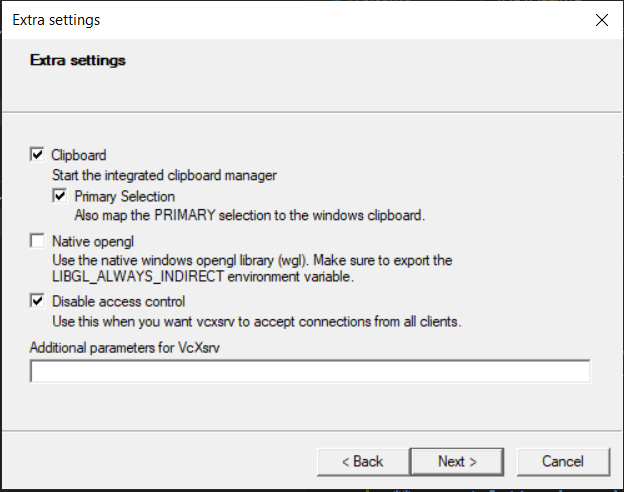

# **WSL (Windows Subsystem for Linux) - (Recommended)**
(For Windows 10)

First we need to install WSL. Follow the below given steps to install WSL2 on Windows 10. (The complete documentation for WSL installation is also given here: [Microsoft](https://docs.microsoft.com/en-us/windows/wsl/install-win10))

## **Step 1: Enable the Windows Subsystem for Linux**

You must first enable the "Windows Subsystem for Linux" optional feature before installing any Linux distributions on Windows.

Open Powershell as administrator and run (i.e. in Start menu search for “cmd” and you will be able to see option of “Command Prompt”, Right click on it and select “Run as administrator” and run the following command)

`dism.exe /online /enable-feature /featurename:Microsoft-Windows-Subsystem-Linux /all /norestart`

Now, we will install WSL 2.

## **Step 2: Enable Virtual Machine Feature**

Before installing WSL 2, you must enable the Virtual Machine Platform optional feature.

Run the following command in the same Powershell opened in the 1st step:

`dism.exe /online /enable-feature /featurename:VirtualMachinePlatform /all /norestart`

Restart your machine to complete the WSL install and update to WSL 2.

## **Step 3: Download the Linux kernel update package**

Download the latest package from here: [WSL2 Linux kernel update package for x64 machines](https://wslstorestorage.blob.core.windows.net/wslblob/wsl_update_x64.msi)

Run the update package downloaded in the previous step. (Double-click to run - you will be prompted for elevated permissions, select ‘yes’ to approve this installation.)

## **Step 4: Set WSL 2 as your default version**

Again open PowerShell and run this command to set WSL 2 as the default version when installing a new Linux distribution:

`wsl --set-default-version 2`

## **Step 5: Install Ubuntu 20.04 LTS Linux distribution**

Open the [Microsoft Store](https://aka.ms/wslstore) and search for “Ubuntu 20.04 LTS” or you can also use the direct link to [Ubuntu 20.04 LTS](https://www.microsoft.com/en-in/p/ubuntu-2004-lts/9n6svws3rx71?rtc=1#activetab=pivot:overviewtab). In the Microsoft Store in Ubuntu 20.04 LTS page select “GET” and then “Install”.

After the installation gets completed, you will be able to see the “Ubuntu 20.04 LTS” option in the Start Menu. Open it.

The first time you launch a newly installed Linux distribution, a console window will open and you'll be asked to wait for a minute or two for files to decompress and be stored on your PC. All future launches should take less than a second. Then it will ask you to create a user account and password for the Linux distribution.

Now, we will set up GUI.

## **Step 6: Set up X-server application VcXsrv**

Download the setup of X-server application VcXsrv from [here](https://sourceforge.net/projects/vcxsrv/).

Now run the downloaded file (Double click on it). After it gets installed you will be able to see XLaunch icon in the Start Menu. Click on it. 

Choose defaults for display settings and how to start a client. When you arrive at the screen of Extra Settings as shown in the below image, uncheck "Native opengl" option and check "Disable access control" option. (i.e. Click next until you arrive at the "Extra Settings" screen and set it as below shown image)

When you click “finish” you will be able to see the VcXsrv icon down in the taskbar that means the server is running.

Now, we need to set the `DISPLAY` environment variable that tells WSL 2 where to send the graphics for any application that needs a display to function. For this, you will need to know the IP address for the Windows host machine. You can find this by going to `Settings -> Network & Internet` and looking under the properties of your current connection (it will be labeled as “IPv4 Address”). 

After getting the IP address open the Linux distribution that you installed (Search "Ubuntu 20.04 LTS" in Start Menu and click on it). Then run this command and replace {your_ip_address} with your IP address:

`echo 'export DISPLAY={your_ip_address}:0.0' >> ~/.bashrc`

Now source the edited .bashrc file by running the following command:

`source ~/.bashrc`

> Note: When you change your network connection, then the IP address will also change. So, you will need to perform these two steps again to configure VcXsrv.

Now, run the following commands to install x11-apps:

`sudo apt update`  
`sudo apt install x11-apps`

**Congratulations! You have successfully installed and set up a Linux distribution and X-server application.**

Now, we are ready to install ROS.

Go through the [ROS Installation](https://github.com/GauravViramgami/ROS-Workshop-TL/blob/main/docs/ROS.md) doc to install ROS.